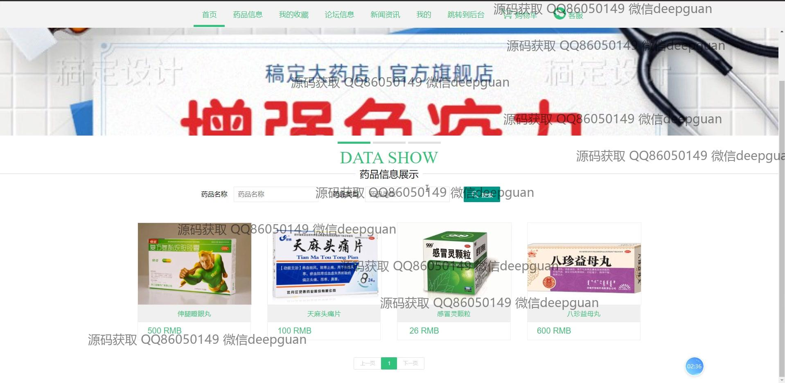
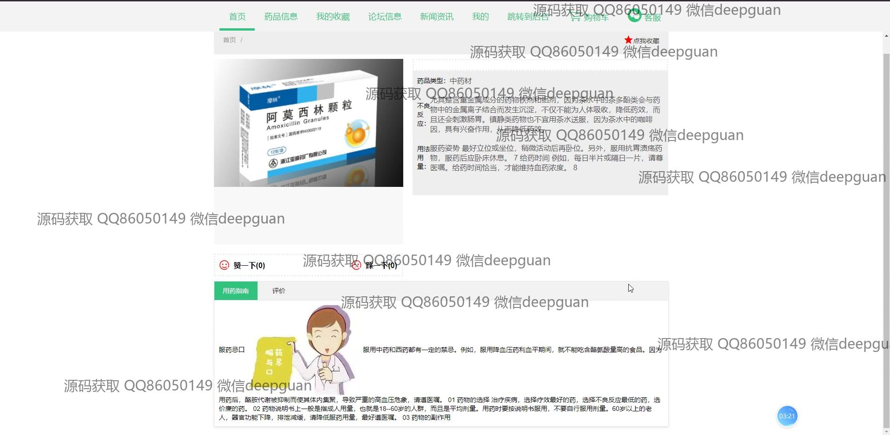

<h1 align="center">医药在线药品销售商城系统</h1>

## 简介
医药在线药品销售商城系统：角色分为管理员、用户；包括用户注册、药品信息管理、订单管理、论坛交流、新闻资讯、客服服务等功能。    --计算机毕业设计源码；毕设源码；java毕业设计源码

## 联系方式

<h3 align="center">获取完整代码与数据库文件 + 微信：deepguan QQ: 86050149 QQ群: 783742310</h3>

<h3 align="center">可帮忙远程部署 包运行成功！提供远程部署、修改代码、设计文档指导、代码讲解等服务！</h3>

## 功能介绍（完整见运行截图）
管理员：基本功能包括登录、注册、退出。可管理网站首页内容，如轮播图及新闻资讯。负责用户管理、药品信息管理、入库和出库记录管理、订单管理等模块。支持药品编辑，包含药品名称、类型、库存、价格、不良反应及用法用量等信息，并提供文件上传功能。可对订单进行查看与批量删除，维护药品数据及系统设置。

用户：基本功能为登录、注册、退出。可浏览网站首页，查看药品信息、新闻资讯、促销活动等。支持药品搜索、浏览药品详情及添加至购物车，并可完成在线支付与订单查询。个人中心提供个人信息查看与修改、地址管理、我的收藏功能，支持与客服即时沟通并参与论坛互动。

购物用户：主要负责药品信息的浏览与购买。可通过首页导航栏访问药品列表、搜索框、购物车等功能。支持查看药品价格、库存、使用说明及促销信息，完成药品在线支付，查询订单状态，并对商品评价与收藏。

论坛用户：可使用论坛功能，发布帖子与评论，与其他用户进行信息交流。论坛支持文本格式化、附件上传等，便于用户分享关于药品使用或健康问题的讨论。

## 运行截图

本代码来源于网络,仅供学习参考使用!

